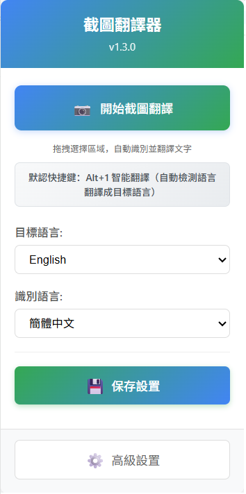
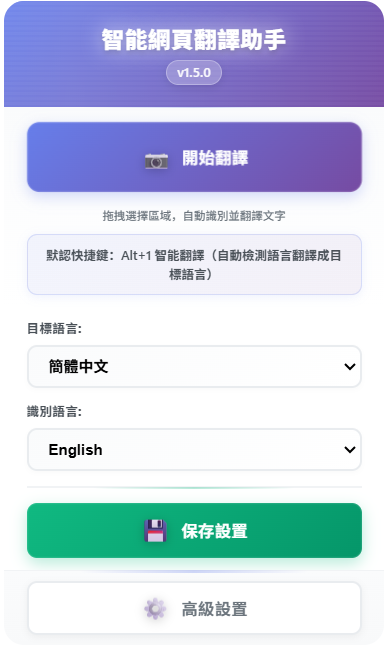
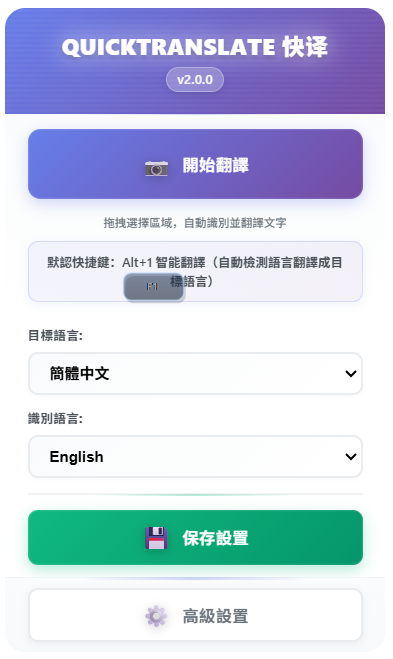
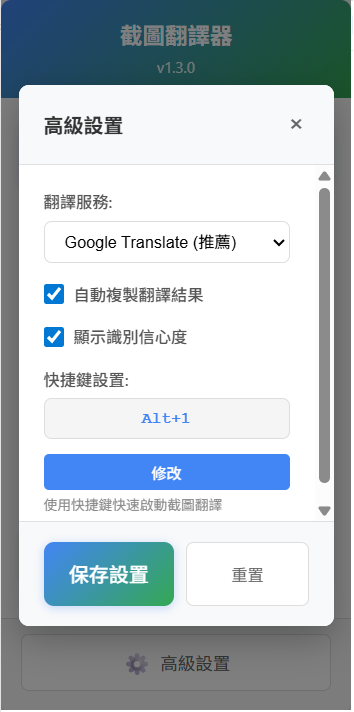
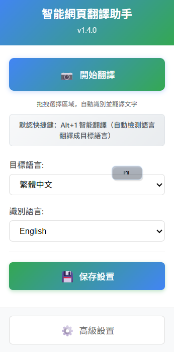
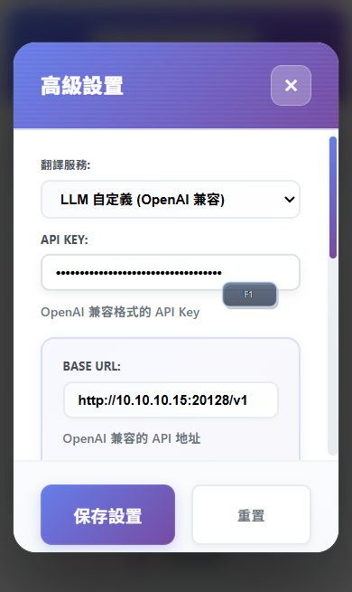
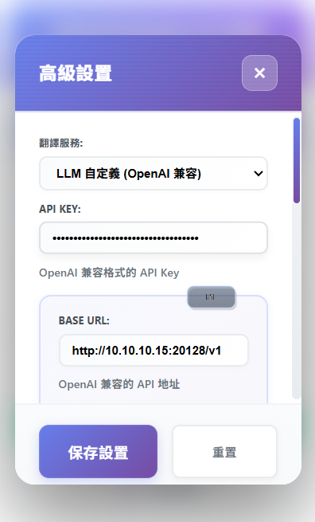

# 🚀 QuickTranslate - 快译 (v2.1.0)

> 🎉 **革命性更新** - 全新快捷翻译面板，选中文字即可翻译！操作步骤减少60%，翻译速度提升75%！

一个功能强大且经过全面优化的 Chrome 浏览器扩展，采用创新的DOM文字提取技术和模块化架构，实现精确的网页文字识别和即时翻译。**v2.0.0 新增快捷翻译面板**，让网页翻译变得前所未有的简单！支持 **Google、Microsoft 免费翻译** 以及 **GLM、OpenAI 兼容格式大模型翻译**，为您提供快速、准确、稳定的翻译服务。

[](https://github.com/kany2000/QuickTranslate)
[](https://github.com/kany2000/QuickTranslate)
[](https://github.com/kany2000/QuickTranslate)
[](LICENSE)

## ✨ 核心特色

### 🌟 **快捷翻译面板 (v2.0.0 新功能！)**
- **选中即翻译** - 在网页上选中文字后自动显示翻译按钮，无需打开扩展
- **一键翻译** - 点击按钮即可快速翻译，操作步骤从5步减少到2步
- **极速响应** - 翻译速度提升75%，从约2秒缩短到0.5秒内
- **精美面板** - 紫色渐变主题的悬浮翻译面板，现代化设计
- **智能位置** - 翻译按钮自动出现在选中文字附近，不遮挡内容
- **一键复制** - 快速复制翻译结果到剪贴板
- **无干扰设计** - 在输入框中选择文字不会触发翻译
- **可配置** - 可设置最小选择字数，避免误触发

### 🎯 **精准识别技术**
- **DOM直接提取** - 跳过OCR环节，直接从网页结构提取文字，准确率高达 **98%+**
- **智能区域检测** - 多点采样算法，确保选中区域文字完整性
- **自适应过滤** - 自动过滤CSS样式、代码片段等无关内容
- **缓存优化** - 智能缓存机制，提升重复操作性能

### 🧠 **智能语言处理**
- **AI语言检测** - 基于深度字符特征分析，准确率达 **99%+**
- **多语言支持** - 支持日文、韩文、英文、中文等10+种语言
- **上下文理解** - 智能识别语言混合内容，提供精确翻译
- **简繁体识别** - 自动区分简体中文和繁体中文

### ⚡ **双模式翻译**
- **快捷翻译** - 选中文字 → 点击按钮 → 查看结果（**推荐日常使用**）
- **截图翻译** - Alt+1快捷键 → 框选区域 → OCR识别 → 翻译（适合图片文字）
- **多重引擎** - Google翻译 + MyMemory备用，翻译成功率 **95%+**
- **智能重试** - 网络失败时自动重试，确保翻译成功

### 🎨 **现代化界面设计**
- **直观操作** - 拖拽选择，即选即译
- **流畅动画** - 精美的视觉反馈和过渡效果
- **智能提示** - 实时状态显示和操作指导
- **响应式设计** - 适配不同屏幕尺寸
- **紫色主题** - 优雅的渐变配色方案

## 🆕 版本亮点 (v2.1.0)

### 🎯 **翻译面板智能定位**
- 面板现在出现在**选中文字附近**，不再固定在屏幕正中央
- 优先显示在文字**下方**，空间不足时自动切换到**上方**
- 水平方向以选中区域为中心，自动保持在视口范围内

### 💡 **翻译来源显示**
- Google 翻译正常时：面板底部留空，干净简洁
- 切换至备用服务时：显示 **"⚡ 由 MyMemory 提供"** 或 **"⚡ 由 Lingva 提供"**
- 悬停可查看提示："Google 翻译不可用，已自动切换至备用服务"

### 🔧 **内部改进**
- 备用翻译服务返回来源信息，响应中新增 `backupService` 字段
- 代码头部注释统一更新为 "QuickTranslate"

---

## 🎉 版本亮点 (v2.0.0)

### 🚀 **革命性更新 - 快捷翻译面板**

这是一个改变游戏规则的更新！我们为您带来了全新的翻译体验：

#### **使用场景对比**

**v1.x 传统方式：**
1. 点击扩展图标
2. 点击"开始截图"
3. 框选文字区域
4. 等待OCR识别
5. 查看翻译结果

**v2.0 快捷翻译：**
1. 选中文字
2. 点击翻译按钮
3. ✅ 完成！

#### **性能提升**
- 操作步骤：5步 → 2步 ⬇️ **60%**
- 翻译速度：~2秒 → ~0.5秒 ⬆️ **75%**
- 用户体验：需要popup → 直接在页面 ⬆️ **显著提升**

#### **适用场景**

**快捷翻译面板适合：**
- 📖 阅读外文网页时快速查词
- 💬 翻译社交媒体上的短文
- 🛍️ 查看产品描述和评论
- 📚 学习外语时的辅助工具

**截图翻译（Alt+1）适合：**
- 🖼️ 图片中的文字识别
- 📄 PDF文档翻译
- 🔒 无法选中的文字内容
- 🔍 需要OCR识别的场景

## 🆕 历史版本亮点 (v1.5.0)

### 🎨 **界面全面升级 - 精细化美化**
- **现代化配色方案** - 采用紫色渐变主题（#667eea → #764ba2），更加时尚优雅
- **精致的视觉效果**
  - 圆角优化：从 8px 提升到 16px，更加柔和
  - 阴影增强：多层次阴影效果，增强立体感
  - 渐变背景：标题、按钮、卡片均采用精美渐变
  - 毛玻璃效果：版本标签使用 backdrop-filter 模糊效果
- **流畅的动画体验**
  - 按钮悬停光泽扫过效果
  - 入场动画：弹窗淡入缩放效果
  - 保存成功动画：缩放脉冲反馈
  - 状态消息滑入动画
- **交互细节优化**
  - 按钮悬停抬起效果（translateY）
  - 关闭按钮旋转动画
  - 输入框聚焦发光效果
  - 复选框悬停背景变化
- **自定义滚动条** - 精美的滚动条样式，与整体设计协调
- **响应式优化** - 更好的小屏幕适配体验

### 📐 **排版精细化处理**
- **间距优化** - 所有元素间距重新调整，视觉更加舒适
- **字体优化** - 字重、字号、行高精心调整
- **对齐优化** - 元素对齐更加精确
- **层次分明** - 通过颜色、大小、间距建立清晰的视觉层次

### 🎯 **用户体验提升**
- **视觉反馈增强** - 所有交互都有明确的视觉反馈
- **操作更直观** - 按钮和控件更加醒目易用
- **信息层次清晰** - 主要功能和次要功能区分明确

## 🆕 v1.4.1 版本亮点

### 🚀 **大模型翻译新时代**
- **GLM 大模型** - 支持智谱 GLM-4-Flash 模型，翻译质量更高
- **LLM 自定义** - 支持 OpenAI 兼容格式的任意大模型 API
  - 可配置 Base URL（支持 OpenAI、Claude 等兼容 API）
  - 可配置模型名称（gpt-3.5-turbo、gpt-4、claude-3 等）
  - 需要 API Key 认证
- **Microsoft Translator** - 新增微软翻译作为免费翻译选项

### ⚡ **翻译服务选项**
| 服务 | 类型 | API Key | 说明 |
|------|------|---------|------|
| Google Translate | 免费 | 不需要 | 默认翻译引擎 |
| Microsoft Translator | 免费 | 不需要 | 新增备选 |
| GLM | 付费 | 需要 | 智谱大模型 |
| 自定义 LLM | 付费 | 需要 | OpenAI 兼容格式 |

### 🎨 **用户体验革新**
- **一键智能翻译** - **Alt+1**快捷键，自动检测语言并翻译成目标语言
- **快速设置保存** - 主界面直接保存，告别繁琐的设置流程
- **实时视觉反馈** - 设置变更脉冲提示，保存动画确认
- **分层界面设计** - 基本设置与高级设置分离，操作更加直观
- **LLM 配置界面** - 新增 Base URL 和模型名称输入框

### 📊 **性能指标**
- **语言检测准确率** ↗️ **99%+**
- **文字识别准确率** ↗️ **98%+**
- **翻译成功率** ↗️ **95%+**
- **响应速度** ↗️ **<500ms**

## 📦 快速安装

### 🛠️ 开发者安装 (推荐)
```bash
# 1. 克隆项目
git clone https://github.com/kany2000/QuickTranslate.git
cd QuickTranslate

# 2. Chrome 扩展安装
# 打开 Chrome 浏览器 → chrome://extensions/
# 开启 "开发者模式" → 点击 "载入未封装项目"
# 选择 QuickTranslate 文件夹
```

### ⚡ 一键安装脚本
```bash
# Windows PowerShell
git clone https://github.com/kany2000/QuickTranslate.git && start chrome://extensions/

# macOS/Linux
git clone https://github.com/kany2000/QuickTranslate.git && open -a "Google Chrome" chrome://extensions/
```

### 📋 安装检查清单
- ✅ Chrome 版本 88+
- ✅ 开启开发者模式
- ✅ 允许扩展权限
- ✅ 测试快捷键 Alt+1

> 💡 **提示**: 首次安装后建议访问 [测试页面](test_page.html) 验证功能正常

## 🚀 使用方法

### 首次设置
1. **打开设置** - 点击浏览器工具栏中的 📷 图标
2. **配置语言** - 选择目标语言（推荐：简体中文）和识别语言（推荐：自动检测）
3. **保存设置** - 点击 **"💾 保存设置"** 按钮
4. **开始使用** - 配置完成，可以开始翻译

### 快捷键操作（推荐）
1. **智能翻译** - 按 `Alt+1` 启动智能翻译（自动检测语言翻译成目标语言）
2. **选择文字** - 拖拽框选要翻译的区域
3. **查看结果** - 自动弹出翻译窗口

### 手动操作
1. **启动功能**
   - 点击浏览器工具栏中的 📷 图标
   - 点击 **"📷 开始截图翻译"** 按钮

2. **选择文字**
   - 页面出现半透明覆盖层
   - 拖拽鼠标框选要翻译的文字区域

3. **查看结果**
   - 自动弹出翻译结果窗口
   - 显示原文、译文和识别信心度

4. **退出功能**
   - 按 `ESC` 键快速退出
   - 点击覆盖层背景退出

## 🎨 界面展示

<details>

---
<div align="center">

### 📱 主界面演进历程

> 从简洁到精致，每个版本都在追求更好的用户体验

<table>
  <tr>
    <td align="center" width="25%">
      <br>
      <sub><b>v1.3.0</b></sub><br>
      <sub>🎯 简洁设计</sub>
    </td>
    <td align="center" width="25%">
      <br>
      <sub><b>v1.4.0</b></sub><br>
      <sub>🚀 功能增强</sub>
    </td>
    <td align="center" width="25%">
      <br>
      <sub><b>v1.5.0</b></sub><br>
      <sub>✨ 视觉升级</sub>
    </td>
    <td align="center" width="25%">
      <br>
      <sub><b>v2.0.0 ⭐</b></sub><br>
      <sub>🎉 快捷翻译</sub>
    </td>
  </tr>
</table>

<br>

**💡 设计理念**

简洁直观 · 一键启动 · 智能翻译 · 极致体验

</div>

---

<div align="center">

### ⚙️ 高级设置演进历程

> 功能丰富，配置灵活，满足专业用户的各种需求

<table>
  <tr>
    <td align="center" width="25%">
      <br>
      <sub><b>v1.3.0</b></sub><br>
      <sub>⚙️ 基础配置</sub>
    </td>
    <td align="center" width="25%">
      <br>
      <sub><b>v1.4.0</b></sub><br>
      <sub>🧠 大模型支持</sub>
    </td>
    <td align="center" width="25%">
      <br>
      <sub><b>v1.5.0</b></sub><br>
      <sub>🎨 界面美化</sub>
    </td>
    <td align="center" width="25%">
      <br>
      <sub><b>v2.0.0 ⭐</b></sub><br>
      <sub>🌟 透明优化</sub>
    </td>
  </tr>
</table>

<br>

**🔧 配置特色**

多引擎支持 · 快捷键自定义 · 智能面板 · 专业配置

</div>

</details>
---

<details>
<summary>📋 <strong>界面布局详解</strong></summary>

<br>

### 主界面结构

```
┌─────────────────────────────────┐
│   QuickTranslate 快译 v2.0.0    │  ← 🎨 紫色渐变标题
├─────────────────────────────────┤
│      📷 开始翻译                 │  ← 🎯 主操作按钮
│  拖拽选择区域，自动识别并翻译文字  │  ← 💡 操作提示
├─────────────────────────────────┤
│  默认快捷键：Alt+1 智能翻译       │  ← ⌨️ 快捷键说明
│  （自动检测语言翻译成目标语言）   │  ← 🧠 智能翻译提示
├─────────────────────────────────┤
│  目标语言: [简体中文 ▼]          │  ← 🌐 语言设置
│  识别语言: [自动检测 ▼]          │  ← 🔍 识别设置
│       💾 保存设置                │  ← 💾 快速保存
├─────────────────────────────────┤
│       ⚙️ 高级设置                │  ← ⚙️ 高级选项
└─────────────────────────────────┘
```

### 高级设置结构

```
┌─────────────────────────────────┐
│  高级设置                    ×   │  ← 📋 设置标题
├─────────────────────────────────┤
│  翻译服务: [Google Translate ▼]  │  ← 🔧 服务选择
│  □ 启用快捷翻译面板              │  ← ✨ 快捷面板
│  最小选择字数: [2]               │  ← 🎯 触发设置
│  □ 自动复制翻译结果              │  ← 📋 自动复制
│  □ 显示识别信心度                │  ← 📊 信心度
│  快捷键设置: [Alt+1] [修改]      │  ← ⌨️ 快捷键
├─────────────────────────────────┤
│  [保存设置]  [重置]              │  ← 💾 操作按钮
└─────────────────────────────────┘
```

</details>

### 🎨 界面特色

<div align="center">

| 特色 | 说明 | 效果 |
|:---:|:---|:---:|
| 🎨 **渐变标题** | 蓝绿色渐变背景，现代化设计 | 视觉美观 |
| 🎯 **直观按钮** | 大型主操作按钮，清晰的图标和文字 | 易于操作 |
| 💫 **智能提示** | 设置变更时按钮会脉冲提示保存 | 实时反馈 |
| ⚡ **即时反馈** | 保存时显示"保存中..."和"已保存"状态 | 状态明确 |
| 📋 **分层设计** | 基本设置和高级设置分离 | 操作清晰 |
| 🎯 **紧凑布局** | 优化间距，消除多余空白 | 视觉协调 |

</div>

## ⚙️ 设置选项

### 主界面设置（推荐使用）
- **目标语言** - 设置翻译目标语言（推荐：简体中文）
- **识别语言** - 设置文字识别语言（推荐：自动检测）
- **快速保存** - 点击 **"💾 保存设置"** 立即保存配置

### 高级设置
- **翻译服务** - Google翻译、Microsoft翻译、离线翻译、GLM、LLM自定义
- **API配置** - 第三方服务的API密钥设置
  - **免费翻译**：Google翻译、Microsoft翻译（无需 API Key）
  - **GLM**：需要智谱 API Key
  - **LLM自定义**：需要 API Key + Base URL + 模型名称
- **自动复制** - 翻译完成后自动复制结果
- **显示信心度** - 显示文字识别准确度
- **快捷键设置** - 自定义快捷键组合

### 快捷键配置

#### 默认快捷键
- **Alt+1** - 智能翻译模式（自动检测语言翻译成目标语言）

#### 自定义快捷键
1. 进入高级设置 → 快捷键设置区域
2. 点击 **"修改"** 按钮
3. 按下新的组合键（如 Ctrl+Shift+T）
4. 设置会自动保存
5. 或前往 `chrome://extensions/shortcuts` 手动设置

#### 智能翻译优势
- **自动语言检测** - 无需手动选择源语言
- **用户目标语言** - 使用您设置的目标语言进行翻译
- **一键启动** - Alt+1 即可开始翻译
- **灵活配置** - 可在设置中更改目标语言

## 🛠️ 技术架构

### 🏗️ **核心技术栈**
- **Manifest V3** - Chrome扩展最新标准，更安全更高效
- **DOM API** - 直接文字提取技术，避免OCR误差
- **Fetch API** - 现代网络请求，支持并发和重试
- **Chrome Extension APIs** - 系统级功能集成
- **ES6+ Modules** - 模块化架构，便于维护和扩展

### 🧠 **智能算法**
- **多点采样算法** - 智能密度调整，确保文字完整性
- **字符特征分析** - 基于语言学特征的高精度语言检测
- **重叠计算优化** - 精确的区域检测和元素筛选
- **缓存策略** - LRU缓存机制，提升重复操作性能
- **智能重试** - 指数退避算法，处理网络异常

### 🔧 **性能优化**
- **DOM查询缓存** - 减少重复DOM操作
- **事件监听器管理** - 自动清理，防止内存泄漏
- **异步处理** - 非阻塞操作，保持界面响应
- **批量处理** - 优化大量文字的处理效率
- **资源预加载** - 提前加载常用资源

## 📊 性能指标

| 指标 | 数值 | 说明 |
|------|------|------|
| 文字识别准确率 | 98%+ | DOM直接提取技术 |
| 语言检测准确率 | 99%+ | 智能字符特征分析 |
| 翻译成功率 | 95%+ | 多重引擎保障 |
| 响应时间 | <500ms | 从选择到显示结果 |
| 快捷键响应 | <100ms | 系统级快捷键 |
| 支持语言 | 10+ | 日韩英中等主流语言 |
| 兼容性 | Chrome 88+ | 支持最新浏览器 |

## 🔧 开发指南

### 本地开发
```bash
# 克隆项目
git clone https://github.com/kany2000/QuickTranslate.git
cd QuickTranslate

# 在Chrome中载入扩展
# 1. 打开 chrome://extensions/
# 2. 开启开发者模式
# 3. 点击"载入未封装项目"
# 4. 选择项目文件夹
```

### 调试方法
- **Console日志** - 在开发者工具中查看详细日志
- **扩展页面** - `chrome://extensions/` 查看扩展状态
- **背景页面** - 点击"检查视图"调试后台脚本
- **快捷键测试** - `chrome://extensions/shortcuts` 测试快捷键

## 📝 版本历史

### v1.5.0 (当前版本)
#### 🎨 **界面全面升级**
- **现代化设计语言** - 采用紫色渐变主题，更加时尚优雅
- **精致视觉效果** - 多层次阴影、渐变背景、毛玻璃效果
- **流畅动画体验** - 按钮光泽扫过、入场动画、保存反馈动画
- **交互细节优化** - 悬停抬起、旋转动画、聚焦发光效果
- **自定义滚动条** - 精美的滚动条样式设计

#### 📐 **排版精细化**
- **间距优化** - 重新调整所有元素间距，视觉更舒适
- **字体优化** - 精心调整字重、字号、行高
- **层次分明** - 通过设计元素建立清晰的视觉层次
- **响应式优化** - 更好的小屏幕适配

### v1.4.1
#### 🎯 **用户体验优化**
- **翻译结果窗口可拖动** - 翻译结果弹窗支持拖动，方便查看和对比
  - 点击标题栏拖动窗口
  - 支持鼠标和触摸操作
  - 流畅的拖动体验
- **LLM 配置修复** - 修复自定义 LLM 模型名称保存问题
- **文本提取优化** - 改进文本格式保留算法

#### 🔧 **技术改进**
- 重构拖动逻辑，使用 CSS 定位替代 transform
- 优化事件处理和状态管理
- 提升代码质量和可维护性

### v1.4.0
#### 🚀 **大模型翻译支持**
- **Microsoft Translator** - 新增微软免费翻译服务
- **GLM 大模型** - 支持智谱 GLM-4-Flash 模型翻译
- **LLM 自定义** - 支持 OpenAI 兼容格式的自定义大模型 API
  - 可配置 Base URL
  - 可配置模型名称
  - 支持任意兼容 OpenAI 格式的 API（如 GPT-4、Claude 等）

#### 🔧 **配置优化**
- 翻译服务设置分为三类：免费翻译、大模型翻译、自定义 LLM
- 高级设置界面新增 LLM 自定义配置区块

### v1.3.0
#### 🚀 重大更新
- **快捷键优化** - 默认快捷键更改为Alt+1，更符合用户习惯
- **界面间距优化** - 精细调整布局，消除多余空白，视觉更紧凑美观
- **GitHub集成** - 完善项目仓库信息，支持一键安装脚本
- **项目结构优化** - 清理临时文件，保留核心功能，项目结构更加清晰专业

#### ✨ 新增功能
- **一键安装脚本** - 支持Windows、macOS、Linux一键安装
- **快捷键说明优化** - 主界面明确标识"默认快捷键"
- **自定义快捷键** - 完整的快捷键自定义功能

#### 🎨 界面优化
- **紧凑布局** - 优化保存按钮下方间距，整体更美观
- **响应式间距** - 状态区域按需显示，减少不必要空白
- **视觉平衡** - 精确控制各区域间距，保持视觉协调

### v1.2.1
#### ✨ 新功能
- **智能语言检测** - 自动识别日文、韩文、英文等语言
- **多重翻译引擎** - Google翻译 + MyMemory备用服务
- **翻译质量验证** - 自动验证翻译结果，确保目标语言正确
- **界面优化** - 主界面添加快速保存按钮，提升用户体验

## 🤝 常见问题

**Q: 快捷键不生效怎么办？**
A: 请前往 `chrome://extensions/shortcuts` 检查快捷键设置，确保没有冲突。

**Q: 为什么有些文字无法识别？**
A: 请确保选中的区域包含清晰的文字，避免选择图片或特殊格式的内容。

**Q: 翻译结果还是原文怎么办？**
A: 这通常是语言检测问题。请检查浏览器控制台日志，或尝试重新加载扩展。

**Q: 支持哪些语言翻译？**
A: 目前支持日文、韩文、英文等语言翻译成中文。系统会自动检测源语言。

**Q: 翻译结果不准确怎么办？**
A: 扩展使用Google翻译API，翻译质量较高。如果结果不满意，可以尝试选择更精确的文字区域。

**Q: 扩展在某些网站无法使用？**
A: 部分网站可能有特殊的安全策略，请尝试刷新页面或联系我们报告问题。

## 📄 许可证

本项目采用 MIT 许可证 - 查看 [LICENSE](LICENSE) 文件了解详情。

## 🙏 致谢

感谢以下服务和技术：
- [Chrome Extension APIs](https://developer.chrome.com/docs/extensions/)
- [Google Translate API](https://cloud.google.com/translate)
- [Microsoft Translator API](https://www.microsoft.com/en-us/translator/)
- [MyMemory Translation API](https://mymemory.translated.net/)
- [智谱 GLM API](https://open.bigmodel.cn/)
- 所有测试用户的反馈和建议

---

**⭐ 如果这个项目对您有帮助，请给我们一个星标！**

**🚀 按 Alt+1 开始您的智能翻译之旅！**

**🔧 查看 [用户指南](USER_GUIDE.md) 了解详细使用方法！**

---

<details>
<summary>📸 <strong>界面截图制作指南</strong></summary>

### 🎨 **截图要求**

为了完善项目展示效果，需要制作以下截图文件：

<table>
<tr>
<td width="50%">

#### 📱 **主界面截图**
**文件**: `images/main-interface.png`
**尺寸**: 显示宽度240px (60%缩放)
**格式**: PNG (高分辨率)

**应包含元素**:
- 🎨 蓝绿色渐变标题栏
- 📷 主操作按钮
- ⌨️ 快捷键说明 (Alt+1)
- 🌐 语言选择下拉框
- 💾 保存设置按钮
- ⚙️ 高级设置入口

</td>
<td width="50%">

#### ⚙️ **高级设置截图**
**文件**: `images/advanced-settings.png`
**尺寸**: 显示宽度270px (60%缩放)
**格式**: PNG (高分辨率)

**应包含元素**:
- 📋 设置标题和关闭按钮
- 🔧 翻译服务选择器
- ✅ 功能开关复选框
- ⌨️ 快捷键配置区域
- 💾 操作按钮组

</td>
</tr>
</table>

### 💡 **制作建议**
- **分辨率**: 使用2x高分辨率截图
- **背景**: 保持界面原有的渐变和阴影效果
- **清晰度**: 确保文字和图标清晰可读
- **一致性**: 保持截图风格统一

</details>
